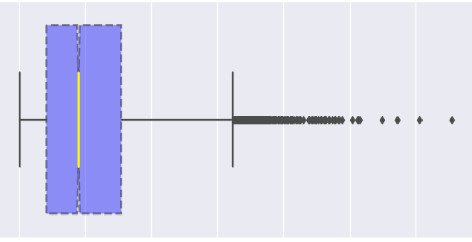

# Food-Sales-Predictions
 
 ## Sales Prediction for Food Items Sold at Various Stores
 
 **Qian Fu**
 
 ## Business problem:
 
 The goal of this is to help the retailer understand the properties of products and outlets that play crucial roles in increasing sales.

## Data Source:

Original data source from https://datahack.analyticsvidhya.com/contest/practice-problem-big-mart-sales-iii/

## Data Dictionary

## Part 1: Data Exploring and Cleaning

### Overview of the tasks done in this part:

•	Original, there were 8523 rows and 12 columns.

•	Dropping unnecessary columns and duplicated rows.

•	Addressing missing values in two columns.

•	Fixing inconsistencies.

•	Obtaining the summary statistics of numerical columns.

### Results.

After cleaning, we have a dataset with 8523 rows and 9 columns which including:

•	4 numerical features: Item_weight, Item_Visibility, Item_MRP, and Item_outlet_sales.

•	2 ordinal features: Item_fat_content and Outlet_size.

•	3 nominal features: Item_type, outlet_location_type, and Outlet_type.

## Part 2: Visualizations for Exploratory Data Analysis (EDA)

### Overview of the tasks done in this part:

	Univariate Visuals: Explore the distribution of each column of data.

•	Bar charts: plotting categorical frequencies.

•	Histograms: plotting continuous distribution.

•	Boxplots: checking any outliers.

	Multivariate Visuals: Explore relationships between variables and differences in groups.

•	Heatmap: looking for correlations between each feature.

•	Scatterplot: checking correlations between numerical features and item sales(target).

•	Bar charts: grouping by categorical columns based on average item sales.

### Results

**Distribution of the Item Sales**

This histogram shows that the majority of the sales are around $2000.

**Are there any outliers in item sales?**

we can see that there are a lot outliers above $6000.

**The average item sales based on the outlet's type, location, and size.**

we can see that the outlet type plays crucial role in increasing sales.

## Part 3: Explanatory Visualizations Tell a Story.

**In this part, through three questions, we can deeply understand how properties of products and outlets that play crucial roles in increasing sales.**

**Q 1: How food type and fat type impact the sales?**

Answer: From this barchart we can see that:

•	Some food types have higher sales on the food with low fat. Ex: soft drinks, snack, breakfast.

•	Some food types have higher sales on the food with regular fat. Ex: dairy, seafood, meat.

•	Overall, food with low fat have higher sales.

•	Only seafood has a significant sale’s difference on the different fat type.

**Q 2: Does Outlet Type makes big difference in Sales?**

Answer: From this pie chart we can see that:

•	Supermarket type3 contributes almost half of the sales.

•	Supermarket type 1 and type 2 have no big difference on sales.

•	Grocery store has very little sales compared to other three outlet types.

**How the outlet size and outlet location distribute in each outlet type?**

Answer: From these pie charts we can see that:

•	For the supermarket type 3 outlet, which makes the most sales, its outlet size is all medium and location type is all Tier 3. Same as supermarket type 2 outlet.

•	Supermarket type 1 outlet has all three outlet location types and outlet size types. But almost half of the outsize type is medium.

•	Grocery store type outlet makes much less sales compared to other 3 outlet types, but half of its outlet location type and outlet size type are Tier3 and medium.

•	Overall, outlets with medium size and Tier 3 location tend to make more sales.

## Part 4: Machine Learning: Training Models to Make the Best Prediction

**Overview of the tasks done in this part:**

In this part, data cleaning is done in two parts: before data spilt and after data spilt to prevent data leakage. After data spilt, columntransformer is created for getting data ready for machine learning. Last, training different models to find out the best model to make the prediction.

**Maching Learning Using the Following Models:**

(-) Linear Regression Model

